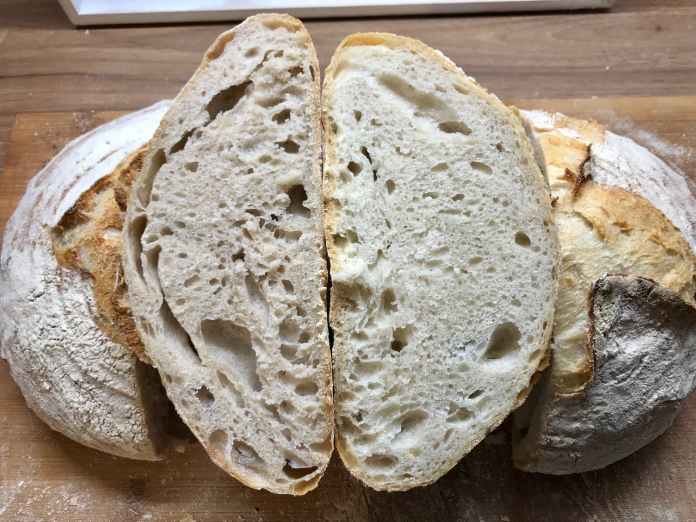

# The Basic Sourdough

Use this basic dough recipe as starter for all your upcoming sourdough breads.
It is very similar to the standard yeast bread recipe with one major
difference. Instead of using industrial yeast, we are using our own sour
dough. The bacteria and yeast will create all the gas to make the loaf nice
and fluffy.

Using sourdough instead of just yeast creates nice sour taste
which will surprise every non bread expert. Sourdough converts your whole
bread into something fully natural. A sourdough bread only contains flour, water
and salt. Bread has been baked like this for thousands of years.

As a side effect your bread will become much more resistant to mold. A sourdough bread
can still sometimes be eaten 3-4 weeks after the bake. In your sourdough bread
bacteria and yeast wage war on each other, blocking each other from spreading
too much. In a yeast bread you do not have bacteria to counteract the yeast.
Thus the yeast bread turns bad much faster.

Overall you can bake every yeast-bread recipe and just replace the yeast with
your sourdough instead. However you can not bake all the sourdough recipes
with yeast instead. Some flours such as rye require the sourdough to become
bakable. See the picture above for a comparison of how the final sourdough vs.
yeast bread looks like.

Other sourdough recipes in the manifesto inherit from this recipe. They override
a few sections with custom steps and or ingredients. The process regardless is
always the same across all the sourdough breads you will bake. Inspirational
ideas are provided as custom recipes in this repository.

`TODO`
